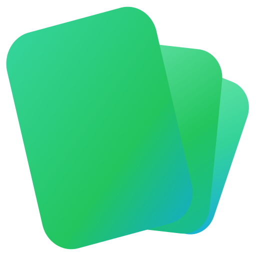

<p align="center">
  
</p>

<h1 align="center">Green Deck</h1>

<p align="center">
  <strong>AI-Powered Intelligent Flashcard Generator</strong>
</p>

<p align="center">
  <a href="#english">English</a> •
  <a href="#português">Português</a>
</p>

<p align="center">
  
  
  
  
  
</p>

---

# English

## Overview

Green Deck is an open-source AI-powered flashcard generator that automatically creates high-quality study cards from text, PDFs, and documents. It integrates seamlessly with **Anki** for spaced repetition learning and supports multiple LLM providers including local models via **Ollama**.

### Why Green Deck?

- **Smart Generation**: Uses LLMs to create both Basic and Cloze deletion cards
- **Quality Filtering**: Multi-stage pipeline ensures only high-quality cards reach your deck
- **Local-First**: Run entirely offline with Ollama, or use cloud providers (OpenAI, Perplexity)
- **Direct Anki Sync**: Upload cards directly to Anki without manual import/export
- **Document Support**: Extract text from PDFs, Word, PowerPoint, Excel, and images (OCR)

## Features

### Flashcard Generation
- **Multiple Card Types**: Basic (Q&A) and Cloze deletion (`{{c1::answer}}`)
- **Multi-Provider LLM Support**:
  - Ollama (local, free)
  - OpenAI (GPT-4, GPT-3.5)
  - Perplexity (Sonar models)
- **Quality Pipeline**:
  - Source validation (ensures cards match source text)
  - Content relevance filtering
  - Quality scoring algorithm
  - Language detection (PT, EN, ES)
- **Card Rewriting**: Densify, simplify, or split cards with AI assistance

### Text Analysis
- **Semantic Chunking**: Intelligent text segmentation using embeddings
- **Topic Segmentation**: Automatic detection of definitions, examples, concepts, formulas, procedures, and comparisons
- **Visual Highlighting**: Color-coded topic overlay in the editor

### Document Processing
- **Supported Formats**:
  - PDF files
  - Microsoft Office (Word, PowerPoint, Excel)
  - Markup (HTML, Markdown, AsciiDoc)
  - Images with OCR (PNG, JPG, TIFF, BMP)
- **Page Selection**: Preview and extract specific pages
- **Quality Levels**: Raw, cleaned, or LLM-refined extraction

### Anki Integration
- **Deck Management**: List, create, and manage decks
- **Card Operations**: Add, update, suspend, and bulk-select cards
- **Field Migration**: Safely move content between note type layouts
- **Card Translation**: Translate cards using LLM with language detection

### Dashboard & Analytics
- **Real-Time Statistics**: Card generation metrics and deck performance
- **Visualizations**: Charts, KPIs, and trend analysis
- **History Tracking**: Browse past analyses and generated cards

## Tech Stack

| Layer | Technology |
|-------|------------|
| **Backend** | FastAPI, Python 3.11+, Uvicorn |
| **Frontend** | Vue 3, Vite, PrimeVue, Quill Editor |
| **Database** | DuckDB (serverless SQL) |
| **AI/ML** | Ollama, OpenAI API, Perplexity API |
| **Document Processing** | Docling (multi-format extraction) |
| **Anki Bridge** | AnkiConnect |

## Installation

### Prerequisites

- Python 3.11+
- Node.js 20+ (recommended: use [nvm](https://github.com/nvm-sh/nvm))
- [Ollama](https://ollama.ai/) (for local LLM)
- [Anki](https://apps.ankiweb.net/) with [AnkiConnect](https://ankiweb.net/shared/info/2055492159) addon

### Quick Start

```bash
# Clone the repository
git clone https://github.com/Erick-Bryan-Cubas/green-deck.git
cd green-deck

# Create and activate virtual environment
python -m venv venv
source venv/bin/activate  # Linux/macOS
# or
.\venv\Scripts\activate  # Windows

# Install Python dependencies
pip install -r requirements.txt

# Install frontend dependencies and build
cd frontend
npm install
npm run build
cd ..

# Start the application
python run.py
```

The application will be available at `http://localhost:3000`

### Ollama Setup

```bash
# Pull recommended models
ollama pull qwen2.5:7b          # For card generation
ollama pull nomic-embed-text    # For embeddings/analysis

# (Optional) Create custom flashcard model
ollama create qwen-flashcard -f models/qwen_flashcard_finetuned/Modelfile
```

### Environment Variables

| Variable | Description | Default |
|----------|-------------|---------|
| `OLLAMA_HOST` | Ollama server URL | `http://localhost:11434` |
| `OLLAMA_MODEL` | Generation model | `qwen-flashcard` |
| `OLLAMA_ANALYSIS_MODEL` | Analysis/embedding model | `nomic-embed-text` |
| `ANKI_CONNECT_URL` | AnkiConnect URL | `http://localhost:8765` |
| `PORT` | Server port | `3000` |

## Usage

### Basic Workflow

1. **Input Text**: Paste or type text in the editor, or upload a document
2. **Analyze**: Click "Analyze" to segment text into topics
3. **Generate**: Select text and click "Generate Cards"
4. **Review**: Preview generated cards and filter as needed
5. **Export**: Upload directly to Anki or copy to clipboard

### Using Cloud Providers

Add your API keys in the settings panel:
- **OpenAI**: Enter your API key for GPT-4/GPT-3.5 access
- **Perplexity**: Enter your API key for Sonar model access

## API Reference

### Card Generation
- `POST /api/generate-cards-stream` - Generate flashcards with streaming
- `POST /api/analyze-text-stream` - Analyze text with embeddings
- `POST /api/segment-topics` - Segment text into topics
- `POST /api/rewrite-card` - Rewrite card (densify/simplify/split)

### Documents
- `POST /api/documents/extract` - Extract text from document
- `POST /api/documents/preview-pages` - Preview document pages

### Anki
- `GET /api/anki-decks` - List all decks
- `POST /api/upload-to-anki` - Upload cards to deck
- `POST /api/anki-translate` - Translate cards

### Health
- `GET /api/health` - System health check
- `WS /ws/status` - WebSocket for real-time status

## Contributing

Contributions are welcome! Please feel free to submit a Pull Request.

1. Fork the repository
2. Create your feature branch (`git checkout -b feature/amazing-feature`)
3. Commit your changes (`git commit -m 'Add amazing feature'`)
4. Push to the branch (`git push origin feature/amazing-feature`)
5. Open a Pull Request

## License

This project is licensed under the MIT License - see the [LICENSE](LICENSE) file for details.

---

# Português

## Visão Geral

Green Deck é um gerador de flashcards open-source com inteligência artificial que cria automaticamente cartões de estudo de alta qualidade a partir de texto, PDFs e documentos. Integra-se perfeitamente com o **Anki** para aprendizado por repetição espaçada e suporta múltiplos provedores de LLM, incluindo modelos locais via **Ollama**.

### Por que Green Deck?

- **Geração Inteligente**: Usa LLMs para criar cartões Básicos e Cloze
- **Filtragem de Qualidade**: Pipeline multi-estágio garante que apenas cartões de alta qualidade cheguem ao seu deck
- **Local-First**: Execute totalmente offline com Ollama, ou use provedores cloud (OpenAI, Perplexity)
- **Sincronização Direta com Anki**: Envie cartões diretamente para o Anki sem importação/exportação manual
- **Suporte a Documentos**: Extraia texto de PDFs, Word, PowerPoint, Excel e imagens (OCR)

## Funcionalidades

### Geração de Flashcards
- **Múltiplos Tipos de Cartão**: Básico (Pergunta/Resposta) e Cloze (`{{c1::resposta}}`)
- **Suporte Multi-Provedor LLM**:
  - Ollama (local, gratuito)
  - OpenAI (GPT-4, GPT-3.5)
  - Perplexity (modelos Sonar)
- **Pipeline de Qualidade**:
  - Validação de fonte (garante que cartões correspondam ao texto fonte)
  - Filtragem de relevância de conteúdo
  - Algoritmo de pontuação de qualidade
  - Detecção de idioma (PT, EN, ES)
- **Reescrita de Cartões**: Densifique, simplifique ou divida cartões com assistência de IA

### Análise de Texto
- **Chunking Semântico**: Segmentação inteligente de texto usando embeddings
- **Segmentação de Tópicos**: Detecção automática de definições, exemplos, conceitos, fórmulas, procedimentos e comparações
- **Destaque Visual**: Sobreposição de tópicos com cores no editor

### Processamento de Documentos
- **Formatos Suportados**:
  - Arquivos PDF
  - Microsoft Office (Word, PowerPoint, Excel)
  - Markup (HTML, Markdown, AsciiDoc)
  - Imagens com OCR (PNG, JPG, TIFF, BMP)
- **Seleção de Páginas**: Visualize e extraia páginas específicas
- **Níveis de Qualidade**: Extração bruta, limpa ou refinada por LLM

### Integração com Anki
- **Gerenciamento de Decks**: Liste, crie e gerencie decks
- **Operações com Cartões**: Adicione, atualize, suspenda e selecione cartões em massa
- **Migração de Campos**: Mova conteúdo entre layouts de tipos de nota com segurança
- **Tradução de Cartões**: Traduza cartões usando LLM com detecção de idioma

### Dashboard e Análises
- **Estatísticas em Tempo Real**: Métricas de geração de cartões e desempenho de decks
- **Visualizações**: Gráficos, KPIs e análise de tendências
- **Histórico**: Navegue por análises e cartões gerados anteriormente

## Stack Tecnológico

| Camada | Tecnologia |
|--------|------------|
| **Backend** | FastAPI, Python 3.11+, Uvicorn |
| **Frontend** | Vue 3, Vite, PrimeVue, Quill Editor |
| **Banco de Dados** | DuckDB (SQL serverless) |
| **IA/ML** | Ollama, OpenAI API, Perplexity API |
| **Processamento de Documentos** | Docling (extração multi-formato) |
| **Bridge Anki** | AnkiConnect |

## Instalação

### Pré-requisitos

- Python 3.11+
- Node.js 20+ (recomendado: use [nvm](https://github.com/nvm-sh/nvm))
- [Ollama](https://ollama.ai/) (para LLM local)
- [Anki](https://apps.ankiweb.net/) com addon [AnkiConnect](https://ankiweb.net/shared/info/2055492159)

### Início Rápido

```bash
# Clone o repositório
git clone https://github.com/Erick-Bryan-Cubas/green-deck.git
cd green-deck

# Crie e ative o ambiente virtual
python -m venv venv
source venv/bin/activate  # Linux/macOS
# ou
.\venv\Scripts\activate  # Windows

# Instale as dependências Python
pip install -r requirements.txt

# Instale as dependências do frontend e faça o build
cd frontend
npm install
npm run build
cd ..

# Inicie a aplicação
python run.py
```

A aplicação estará disponível em `http://localhost:3000`

### Configuração do Ollama

```bash
# Baixe os modelos recomendados
ollama pull qwen2.5:7b          # Para geração de cartões
ollama pull nomic-embed-text    # Para embeddings/análise

# (Opcional) Crie modelo personalizado para flashcards
ollama create qwen-flashcard -f models/qwen_flashcard_finetuned/Modelfile
```

### Variáveis de Ambiente

| Variável | Descrição | Padrão |
|----------|-----------|--------|
| `OLLAMA_HOST` | URL do servidor Ollama | `http://localhost:11434` |
| `OLLAMA_MODEL` | Modelo de geração | `qwen-flashcard` |
| `OLLAMA_ANALYSIS_MODEL` | Modelo de análise/embedding | `nomic-embed-text` |
| `ANKI_CONNECT_URL` | URL do AnkiConnect | `http://localhost:8765` |
| `PORT` | Porta do servidor | `3000` |

## Como Usar

### Fluxo Básico

1. **Insira Texto**: Cole ou digite texto no editor, ou faça upload de um documento
2. **Analise**: Clique em "Analisar" para segmentar o texto em tópicos
3. **Gere**: Selecione o texto e clique em "Gerar Cartões"
4. **Revise**: Visualize os cartões gerados e filtre conforme necessário
5. **Exporte**: Envie diretamente para o Anki ou copie para a área de transferência

### Usando Provedores Cloud

Adicione suas chaves de API no painel de configurações:
- **OpenAI**: Insira sua chave de API para acesso ao GPT-4/GPT-3.5
- **Perplexity**: Insira sua chave de API para acesso aos modelos Sonar

## Referência da API

### Geração de Cartões
- `POST /api/generate-cards-stream` - Gerar flashcards com streaming
- `POST /api/analyze-text-stream` - Analisar texto com embeddings
- `POST /api/segment-topics` - Segmentar texto em tópicos
- `POST /api/rewrite-card` - Reescrever cartão (densificar/simplificar/dividir)

### Documentos
- `POST /api/documents/extract` - Extrair texto de documento
- `POST /api/documents/preview-pages` - Visualizar páginas do documento

### Anki
- `GET /api/anki-decks` - Listar todos os decks
- `POST /api/upload-to-anki` - Enviar cartões para deck
- `POST /api/anki-translate` - Traduzir cartões

### Saúde
- `GET /api/health` - Verificação de saúde do sistema
- `WS /ws/status` - WebSocket para status em tempo real

## Contribuindo

Contribuições são bem-vindas! Sinta-se à vontade para enviar um Pull Request.

1. Faça um fork do repositório
2. Crie sua branch de feature (`git checkout -b feature/recurso-incrivel`)
3. Faça commit das suas alterações (`git commit -m 'Adiciona recurso incrível'`)
4. Faça push para a branch (`git push origin feature/recurso-incrivel`)
5. Abra um Pull Request

## Licença

Este projeto está licenciado sob a Licença MIT - veja o arquivo [LICENSE](LICENSE) para detalhes.

---

<p align="center">
  Made with :green_heart: for the learning community
</p>
